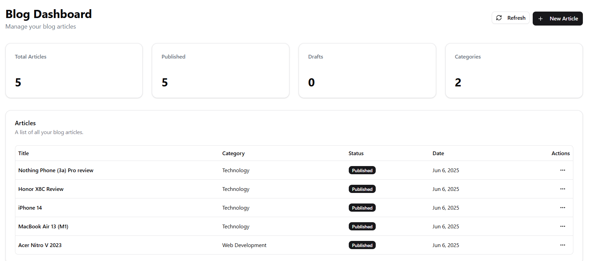
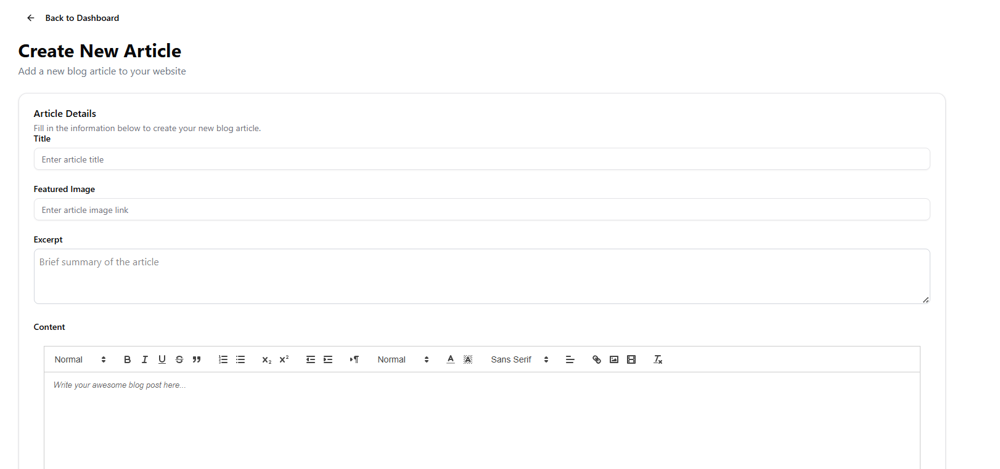

# ✍️ Next.js AI-Powered Blog Platform

A **full-featured blog application** built with the **Next.js** framework. This platform supports **secure user authentication**, **full blog post CRUD**, and **AI-powered content summarization** using OpenAI. It features a polished, responsive UI with an intuitive dashboard for both writing and reading experiences.

---

## 🖼️ Images

| Blog Home Page                   | Post Creation Page               |
|---------------------------------|---------------------------------|
|    |  |

| Blog Post with Summary           | Admin Dashboard                 |
|---------------------------------|-------------------------------|
|   |  |

---

## 🚀 Features

### 👤 Authentication & Authorization
- Secure login and registration via [Clerk](https://clerk.dev)
- Role-based access for blog management

### 📝 Blog Functionality
- Create, read, update, and delete blog posts
- Rich text editor for composing posts
- Slug-based routing for SEO-friendly URLs

### 🤖 AI-Powered Summarization
- Automatically summarize blog content using [OpenAI API](https://platform.openai.com/)
- Helps readers quickly grasp key points

### 📊 Dashboard
- Personalized dashboard to manage blogs
- Post management interface for writers

---

## 🛠️ Technologies Used

| Tech         | Description                                |
|--------------|--------------------------------------------|
| Next.js      | Full-stack React framework                 |
| Clerk        | Authentication and user management         |
| OpenAI API   | For generating content summaries           |
| Prisma ORM   | Type-safe database access                  |
| PostgreSQL   | Relational database                        |
| Shadcn UI    | Beautiful and responsive component library |
| TailwindCSS  | Utility-first CSS framework                |
| TypeScript   | Static typing for better development       |

---

## 📦 Getting Started

First, install dependencies:

```bash
npm install
# or
yarn install
